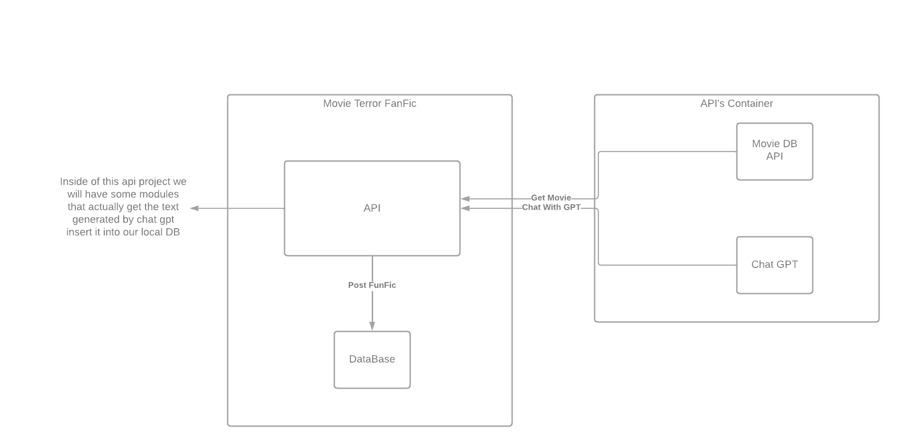

# Movie Mania

This project has the purpose of learning Django and get more familiarity with python3, API consumption and dealing with data. 

## Theme

The theme of this project is Movies, so we will consum data from 
[TheMoviedb](https://www.themoviedb.org/) and bring this data to our own local DataBase and make it valuable for us. 

## About the structure of this project

To learn more about the best prictices of Python and Django I'm goig to use the documentation [Structuring Your Project](https://docs.python-guide.org/writing/structure/), as a beginner I don't know much about Python Conventions or how a good python project structure should be, maybe this can enlight me a little bit. 

For Django convention and best practice I'll be using a StudyGyann article about Django Best Practices, you can read it [here](https://studygyaan.com/django/best-practice-to-structure-django-project-directories-and-files#:~:text=The%20way%20I%20like%20to,content%20in%20the%20media%20folder.&text=If%20playback%20doesn't%20begin%20shortly%2C%20try%20restarting%20your%20device.).

## Software Design

## Frameworks and Tools

|Name |Version|
|-----|--------|
|Python|3       |
|Django  |1.8   |
|Mysql  |8.0.27 |
|HTML  |5   |
|CSS  |3   |
|Bootstrap  |3  |